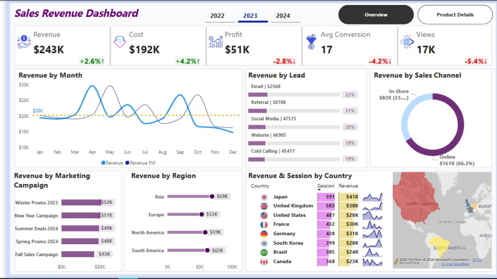

# 📊 Sales Revenue Dashboard

## An interactive sales revenue dashboard created to visualize and analyze key business metrics, including revenue, cost, profit, views, product performance, and sales insights for the year 2023.

## [Dive into the Interactive Report](https://shorturl.at/oaVtZ)
## 🔍 Overview

This dashboard provides an end-to-end view of overall sales performance and product-level details. It helps identify trends, top-performing products, and areas needing improvement.

## 🎯 Objective

* Track yearly and monthly revenue trends.
* Compare cost and profit over time.
* Analyze conversion rates and views.
* Understand revenue contribution by region, country, marketing campaign, sales channel, and lead source.
* Evaluate individual product performance to optimize inventory and sales strategy.

## 🛠 Tools Used

* Microsoft Power BI
* Excel (for data preprocessing)
* DAX (for calculated measures)
* Power Query

### 📌 Overview

* **Total Revenue**: \$243K (+2.6%)
* **Cost**: \$192K (+4.2%)
* **Profit**: \$51K (-2.8%)
* **Avg Conversion**: 17 (-4.2%)
* **Views**: 17K (-5.4%)
* Highest revenue by sales channel: Online (\$161K, 66.3%).
* Top region: Asia (\$69K).
* Best performing marketing campaign: Winter Promo 2023 (\$52K).
* Highest sessions: Japan (591 sessions).

### 📌 Product Details

* Best selling product: **Gaming Console Z** (\$28,417 revenue, \$5,445 profit).
* Other notable products with strong performance: **Soundbar 360**, **Headphones Plus**, **Desktop PC Ultra**.
* All products rated 5–6 stars, ensuring consistent product quality.

## ✅ Key Takeaways

* Online sales contribute most of the revenue.
* Winter and New Year campaigns were most effective.
* Asia and North America are the strongest regions.
* Conversion rate and views have slightly decreased, suggesting a need for better engagement strategies.
* Gaming and entertainment products dominate the top revenue and profit list.

## 📦 Conclusion

This dashboard provides clear, actionable insights to drive business growth. It highlights top products, most effective campaigns, and regional performance, enabling better strategic planning and decision making.

## 🧑‍💻 Created by

**Nazrul Islam**  
📍 Data & Business Analyst  
📧 [nazrul.contact007@gmail.com](mailto:nazrul.contact007@gmail.com)

---

## 🌐 Let's Connect

- [LinkedIn](https://www.linkedin.com/in/nazrul-islam45)
- [Portfolio Website](https://your-portfolio-site.com)  

---

> ⭐ *If you found this project helpful or inspiring, feel free to star the repository and connect with me on LinkedIn!*
